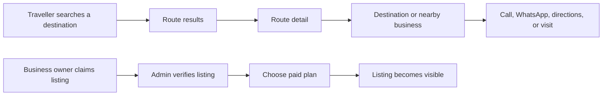

# Nielekeze

**Nielekeze** is a Dar es Salaam daladala route finder that helps people find the best route to shops and other destinations based on where they are located. It helps people compare routes, fares, transfers, and route maps so they can reach a destination with more confidence.

The commercial direction is simple: make the route finder useful first, then allow local businesses to pay for accurate, visible listings that travellers can discover while planning where to go.

## Product Today

- Search active locations by name or alias.
- Find available routes between an origin and destination.
- Compare fare and connection information.
- View route detail and maps with Leaflet.
- Admin sign-in and first-admin setup.
- Admin tools to create, edit, activate, deactivate, and delete locations and routes.
- JWT-protected management APIs.

The current codebase does **not** yet include business listings, payments, visitor analytics, or an analytics dashboard. The plan below treats those as the next product stages, rather than claiming they already exist.

## Local Setup

### Requirements

- XAMPP with Apache and MySQL running.
- PHP 8.1 or newer with PDO MySQL and Fileinfo enabled.
- A MySQL database named `nielekeze`.

### Run Locally

1. Place the project in `C:\xampp\htdocs\Nielekeze`.
2. Copy `.env.example` to `.env`.
3. Set the database settings, `SECRET_KEY`, `ADMIN_SETUP_SECRET`, and `ALLOWED_ORIGINS` in `.env`.
4. Ensure the database schema for `users`, `locations`, `location_aliases`, `routes`, and `route_stops` exists.
5. Start Apache and MySQL from the XAMPP Control Panel.
6. Open `http://localhost/Nielekeze/`.

### Pages

| URL | Purpose |
| --- | --- |
| `/Nielekeze/` | Public route finder |
| `/Nielekeze/route?id={id}` | Route-detail page |
| `/Nielekeze/setup-admin` | Create the first administrator |
| `/Nielekeze/admin` | Administrator sign-in and data management |
| `/Nielekeze/api/v1/health` | API health check |

The routing layer accepts `Nielekeze` or `nielekeze` in the URL path. Use clean URLs such as `/Nielekeze/admin`, not `/Nielekeze/index.php/admin`.

### First Administrator

1. Open `/Nielekeze/setup-admin`.
2. Enter the `ADMIN_SETUP_SECRET` value from your local `.env` file.
3. Create an account with a password of at least 12 characters containing uppercase, lowercase, and a number.
4. Sign in at `/Nielekeze/admin`.

After the first admin exists, creating another admin requires an authenticated administrator token.

## Daily Operations

### Route Data Quality

Use the admin area to manage locations and routes. Every route should have:

- a clear name;
- valid origin and destination locations;
- stops in travel order, beginning at the origin and ending at the destination;
- an estimated fare when it is known;
- a verification status and source;
- active status only when travellers can actually use it.

Treat public search quality as the core product. Incorrect routes and fares cost user trust faster than missing coverage. Review community reports, changes in fares, roadworks, and route closures on a regular schedule.

### Weekly Management Checklist

- Review unsuccessful searches and add the locations people look for most.
- Verify the busiest routes, fares, stop order, and route status.
- Check API errors and server logs.
- Review visitor, search, and listing metrics.
- Contact new business-listing leads and expiring subscribers.
- Back up the database before structural changes or bulk edits.

### Monthly Management Checklist

- Publish a concise metrics report: traffic, searches, engagement, errors, costs, and revenue.
- Remove or correct inactive businesses and obsolete routes.
- Reconcile paid listings against mobile-money or payment-provider records.
- Test a database restore using a non-production copy.
- Rotate secrets if access has changed or a secret may have been exposed.

## Business Listings Roadmap

### Value Proposition

Businesses pay to be found by people already planning a trip. A listing should answer four practical questions:

1. What is this place?
2. Where is it?
3. What is the nearest route or stop?
4. How can a visitor contact or visit it?

Do not sell placement before the route data is useful. The listing product earns trust when it improves the traveller's decision instead of interrupting it.

### Recommended Listing Tiers

| Tier | Suitable For | Included |
| --- | --- | --- |
| Free / claimed | New businesses | Name, category, address, map location, standard route link |
| Verified | Established shops | Verified badge, phone/WhatsApp, business hours, photos, description |
| Featured | Businesses seeking more visits | Prominent placement in relevant results, campaign reporting, route-based discovery |

Featured placement must be labelled as sponsored. Ranking organic route results by payment would damage the product; sponsorship belongs beside destination discovery, never inside a route calculation.

### Minimum Listing Data Model

Add a dedicated `businesses` table rather than mixing shops into the `locations` table. A location is a geographic stop or place; a business is an organisation at, or near, a location.

Suggested fields:

```text
businesses
  id, owner_user_id, name, slug, category, description
  location_id, latitude, longitude, address
  phone, whatsapp, website, opening_hours
  status, verification_status, featured_until
  created_at, updated_at

business_photos
  id, business_id, image_path, alt_text, sort_order

listing_subscriptions
  id, business_id, plan, amount_tzs, status
  starts_at, ends_at, payment_reference
```

Use `location_id` to attach a business to an existing landmark, bus stop, or destination. Keep optional coordinates for shops that sit near, rather than exactly at, a known location.

### Suggested User Journey



### Payment Workflow

Start with a manual payment process and a clear internal ledger before integrating payments:

1. Business owner submits or claims a listing.
2. Admin verifies ownership, contact details, category, and location.
3. Owner pays through the chosen mobile-money or payment provider.
4. Admin records the payment reference and subscription dates.
5. The listing becomes active or featured.
6. Send renewal reminders before `featured_until` or `ends_at`.

When volume justifies it, integrate a provider that supports the markets you serve and verify payment callbacks server-side. Never activate a paid plan solely from a browser response.

## Measurement Plan

### Metrics That Matter

| Metric | What It Answers | Recommended Definition |
| --- | --- | --- |
| Visitors/day | Is there demand? | Distinct anonymous visitor IDs per calendar day |
| Page views | How much is the site used? | Each client-side page view or full page load |
| Returning visitors | Do people come back? | Visitors seen before the current reporting period |
| Popular pages | What do users want? | Page views grouped by page path |
| Average session duration | Are people engaged? | Mean of `session_end - session_start` for completed sessions |
| Route searches | Is the core task being used? | Successful `route_search` events |
| Zero-result searches | What coverage is missing? | Searches that return no route or no matching location |
| Listing views | Are listings valuable? | `business_view` events grouped by business |
| Listing actions | Are listings driving visits? | Calls, WhatsApp clicks, map opens, and website clicks |
| Errors | What is broken? | Client and API errors grouped by route, endpoint, and release |
| Database size | Is data growth manageable? | Database size in MB plus row counts by table |
| Bandwidth | What hosting plan is needed? | Total outbound bytes per day and month |
| CPU / resources | Is hosting sufficient? | CPU, memory, request latency, and error rate from host monitoring |
| Revenue | Is the project becoming profitable? | Confirmed listing payments, refunds, and net revenue in TZS |

### Events to Collect

Use a small, first-party event endpoint such as `POST /api/v1/analytics/events`. Avoid storing raw search text when it is not necessary. Store an anonymous visitor ID in a first-party cookie or local storage, rotate sessions after 30 minutes of inactivity, and do not collect passwords, tokens, full IP addresses, or sensitive form values.

| Event | Trigger | Useful Properties |
| --- | --- | --- |
| `page_view` | A public page is displayed | `path`, `referrer_domain` |
| `route_search` | Traveller submits origin and destination | `origin_id`, `destination_id`, `result_count` |
| `zero_result` | Search has no usable result | `origin_id`, `destination_id`, `reason` |
| `route_detail_view` | A route is opened | `route_id` |
| `business_view` | A business card/detail is shown | `business_id`, `placement` |
| `business_contact_click` | Call, WhatsApp, website, or directions chosen | `business_id`, `action` |
| `client_error` | An unexpected frontend failure occurs | `page`, `message`, `release` |

Record event timestamps on the server. Derive daily, weekly, and monthly reports from server-side data, not only browser counters.

### Analytics Implementation Order

1. Add a privacy notice and consent choice before non-essential analytics.
2. Build an `analytics_events` table and first-party event endpoint.
3. Track only `page_view`, `route_search`, and `zero_result` initially.
4. Add an admin analytics page showing the last 7, 30, and 90 days.
5. Add listing-view and contact-click attribution when business listings launch.
6. Add error monitoring, host-level CPU, memory, bandwidth, and database-size reporting.

For a fast initial launch, a privacy-respecting hosted analytics service can replace steps 2–4. Keep first-party business-action events in your own database because they are part of your commercial reporting.

## Dashboard Design

Add an Analytics section to the existing admin area. It should answer decisions, not merely display charts.

### Overview Cards

- Visitors today and versus yesterday.
- Route searches today.
- Search success rate.
- Returning visitor rate.
- Active paid listings.
- Monthly recurring listing revenue.

### Operations Views

- Most searched origins and destinations.
- Most common zero-result searches.
- Most-viewed routes.
- Top businesses by views and contact actions.
- API error rate and slowest endpoints.
- Database size, monthly bandwidth, and host resource usage.
- Subscription renewals due in the next 30 days.

### Core Calculations

$$
\text{Search success rate} = \frac{\text{route searches with one or more results}}{\text{all route searches}} \times 100
$$

$$
\text{Returning visitor rate} = \frac{\text{returning visitors}}{\text{all visitors}} \times 100
$$

$$
\text{Listing action rate} = \frac{\text{listing contact actions}}{\text{listing views}} \times 100
$$

$$
\text{Monthly recurring revenue} = \sum \text{active paid subscription amounts for the month}
$$

## Hosting and Capacity

### Start Small, Measure Early

A small paid shared host or low-cost managed host can support an early version if it provides HTTPS, a current PHP version, MySQL backups, cron jobs, access logs, and resource metrics. Free hosting is appropriate only for a temporary demonstration, not a business that handles paid listings.

Review these thresholds monthly:

- Median and 95th-percentile API response time.
- Error rate above $1\%$.
- CPU or memory consistently above $70\%$.
- Database growth approaching host quota.
- Bandwidth approaching host quota.
- Backup or restore failures.

Move to stronger hosting before a limit affects public route searches or payment administration.

### Backups and Security

- Keep `.env` outside version control. It contains credentials and secrets.
- Use unique production database credentials and long random keys.
- Restrict `ALLOWED_ORIGINS` to real frontend domains in production.
- Enforce HTTPS before launching paid listings.
- Back up MySQL daily and retain multiple restore points off-server.
- Test restore procedures, not only backup creation.
- Review administrator accounts and revoke access promptly when staff leave.
- Keep Apache, PHP, MySQL, and dependencies patched.

## API Snapshot

Public endpoints:

```text
GET  /api/v1/health
GET  /api/v1/locations/search?q={query}
GET  /api/v1/locations
GET  /api/v1/locations/{id}
GET  /api/v1/routes/search?from={location_id}&to={location_id}
GET  /api/v1/routes
GET  /api/v1/routes/{id}
```

Authenticated endpoints cover registration, login, current-user details, location management, and route management. Administrator operations require a Bearer token returned by the login endpoint.

## Product Priorities

1. Maintain trustworthy route, stop, and fare data.
2. Measure route-search demand and zero-result searches.
3. Add business claims and verified free listings.
4. Add paid verified and featured plans with an auditable payment ledger.
5. Report listing views and contact actions to businesses.
6. Scale hosting only as measured demand requires it.

The strongest proof of value is not traffic alone. It is a traveller successfully reaching a destination and a local business seeing measurable, repeatable discovery from that journey.
